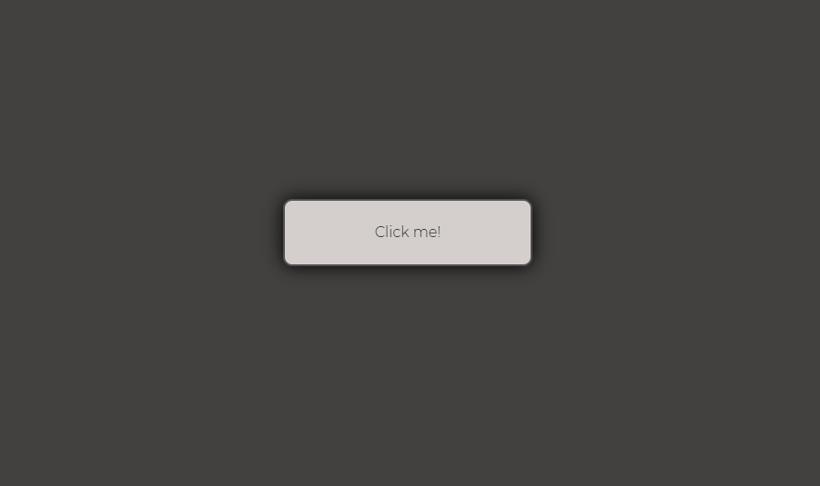
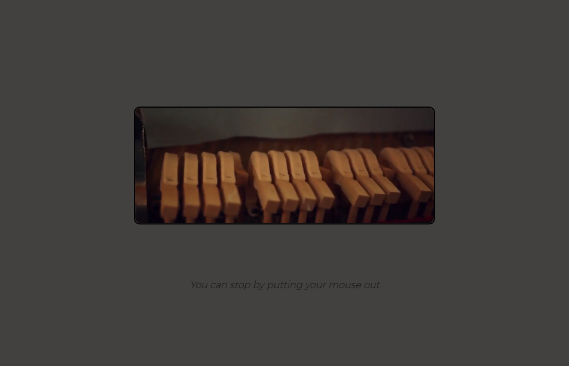

## Piano Website!

Opa eae!

Esse site é basicamente uma junção das minhas habilidades em <strong>JavaScript</strong> e <strong>HTML5</strong>.  
Nele, ao clicar no botão central é expandido e sua opacidade cai, tocando Liebestraum no.3 de Franz Liszt com um vídeo de martelos de piano em loop.

